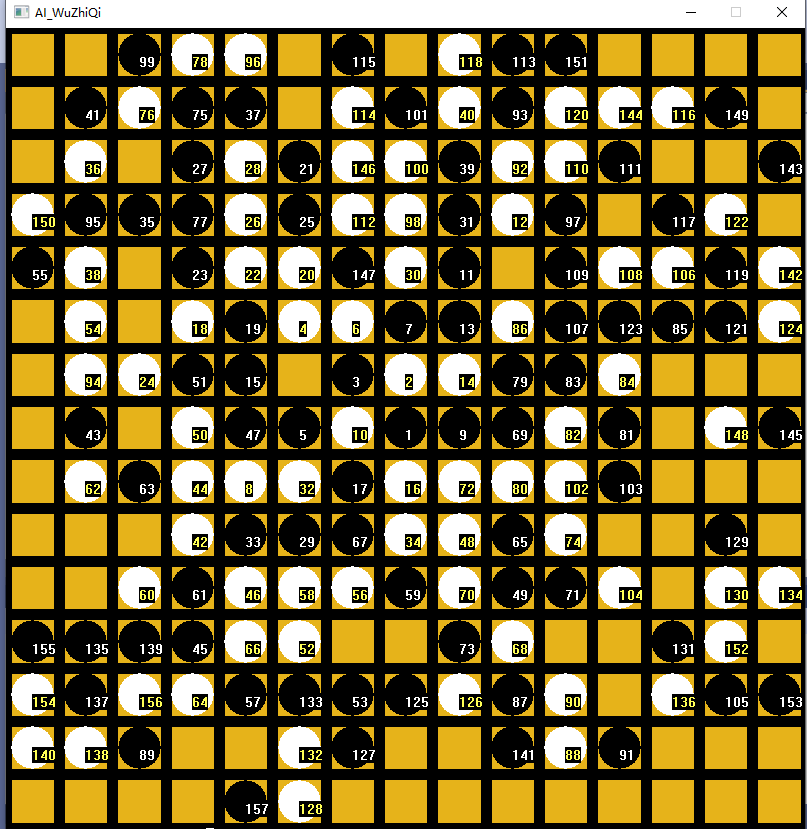

# 五子棋

# 目录
### [做什么](#jump_1)
### [怎么做](#jump_2)
### [做得如何](#jump_3)  
### [参考文献](#jump_4)  
# 做什么<span id="jump_1"></span>
黑白棋可选，可看ai打架，无禁手，能记录每一步棋子是第几步，并在棋子上显示出来，无其他功能。
# 怎么做<span id="jump_2"></span>
## 图形界面：EasyX
## IDE：VS
## 模块：
### main（最上级控制,，兼负EasyX以外的输入输出（CMD输入输出）
主控main函数
```
int main()
{
    //载入预先储存的数据（为计算棋子价值用),若找不到文件，则现场生成并储存。
    if (_access("save_value.txt", 4) != 0) {
        Save_Value();
    }
    if (_access("save_value_for_find_road.txt", 4) != 0) {
            Save_Value_For_Find_Road();
        }
    Load_Value();
    //载入内置棋盘
    chessboard_p = (int**)malloc(sizeof(int*) * chess_long);
    for (int i = 0; i < chess_long; i++) {
        chessboard_p[i] = chessboard[i];
    }
    //玩家使用命令行输入对局的设置（先手后手等）
    CMD_Input();
    //让玩家在对局结束后还能查看棋盘
    Sleep(1000000);
}
```
主要下棋模块，共有3个版本（分别为玩家先手，玩家后手，AI对战AI)\
此处展示的是玩家先手的版本。
```
void Player_Ai_Play(int ai_1 ) {
    //给玩家一定反应时间，让玩家看清AI下到了哪里。
    int pause_time = 500;
    //一致持续，直到找到胜利的一方：break
    while (true) {
        //若UI_and_Input模块传入玩家输入
        if (Is_Input()) {
            //获取玩家输入
            pos_2D pos = Get_Mouse_Input(chess_long);
            //记录last_pos,给find_action使用
            last_pos = pos;
            //如果玩家输入没有越界
            if (pos.x >= 0 && pos.x < chess_long && pos.y >= 0 && pos.y < chess_long) {
                //若玩家输入在空的位置上
                if (chessboard_p[pos.y][pos.x] == 0) {
                    //记录到内置的三个棋盘中
                    Change_Chessboard(pos.y,pos.x,player_side,chessboard_p);
                    //显示给玩家
                    Add_Chess(pos.x, pos.y, player_side, chess_long);
                    //检测是否胜利
                    if (Find_Win(chessboard_p, chess_long, pos.x, pos.y, player_side)) {
                        outtextxy(10, 20, (LPCTSTR)L"You Win");
                        break;
                    }
                    Sleep(pause_time);

                    //AI寻找最优解
                    pos_2D pos = Find_Action(chessboard_p, chess_long, ai_side, is_start, ai_1, last_pos);
                    last_pos = pos;
                    Change_Chessboard(pos.y,pos.x,ai_side,chessboard_p);
                    Add_Chess(pos.x, pos.y, ai_side, chess_long);
                    if (Find_Win(chessboard_p, chess_long, pos.x, pos.y, ai_side)) {
                        outtextxy(10, 20, (LPCTSTR)L"Ai Win");
                        break;
                    }
                }
            }
        }
    }
}
```
### Input_and_UI(负责EasyX输入与输出)\
略
### Find_Action(通过使用Find_Value中的函数，找到最优解，返回到main中)\
最上层，根节点
```
pos_2D Alpha_Beta_Tree_Extent_Limit_Seach_Control(int** chessboard, int chess_long, int ai_side, int deep_of_tree, int extent_limit,pos_2D last_pos) {
	pos_2D pos;
	int max_now = MIN_OF_INT, min_now = MAX_OF_INT;

	//通过启发式函数，找到最有可能的下棋位置
	int sub_arr[POW_CHESS_LONG];
	Find_Road(chessboard, sub_arr, chess_long,  ai_side, true, deep_of_tree, extent_limit);

	//逐个搜索，记录最优点和最大的值
	for (int i = 0; i < extent_limit; i++) {
		Alpha_Beta_Tree_Extent_Limit_Check_Value_Unit_Control(chessboard, chess_long, ai_side, deep_of_tree, extent_limit,
			max_now, last_pos, pos, sub_arr[i] % chess_long, sub_arr[i] / chess_long);
	}
	//返回最优点
		return pos;
}
```
根节点的执行内容，负责找出最优点并记录
```
void Alpha_Beta_Tree_Extent_Limit_Check_Value_Unit_Control(int** chessboard, int chess_long, int ai_side, int deep_of_tree, int extent_limit,int& max_now, pos_2D last_pos, pos_2D& pos, int x, int y) {
	if (chessboard[y][x] == 0) {
		int value = 0;
		//检查当前格的价值
		int value_here = Find_Value_Totle(chessboard, chess_long, x, y, ai_side, 6, deep_of_tree);
		//若该格会影响胜负关系，直接返回，
		if (Check_Win(value_here)) {
			//防止更低层的胜利结果影响该返回。
			value = 20000000* (1 + deep_of_tree);
		}
		else {
			//在内置棋盘下下该子
			Change_Chessboard(y, x, ai_side, chessboard);
			if (deep_of_tree != 0) {
				
				//进行alpha-beta剪枝搜索
			value =
					Alpha_Beta_Tree_Dir_Extent_Limit
					(chessboard, chess_long, ai_side, deep_of_tree - 1, extent_limit, false,
					max_now - value_here, last_pos);
			}
			//加上该点的价值
			value += value_here;
			//在内置棋盘去除该子
			Change_Chessboard(y, x, 0, chessboard);
		}
		//更新最大值与最优点
		if (value > max_now) {
			max_now = value;
			pos.x = x;
			pos.y = y;
		}

	}
}
```
其他节点的总控，与第一层主控相似，因为最后一层进行启发式函数的成本和直接搜索差不多，不在使用启发式函数限制广度，而是直接进行搜索。通过特定搜索顺序，围绕上一步着棋点进行搜索，以期尽早搜出特异值，使剪枝提前。
```

int Alpha_Beta_Tree_Dir_Extent_Limit(int** chessboard, int chess_long, int ai_side, int deep_of_tree,int extent_limit, bool is_max_side, int now_value, pos_2D last_pos) {

	int max_now = MIN_OF_INT, min_now = MAX_OF_INT;

	//当前层级结论的最大，最小值

	//这一个节点是求最大的，上一个节点是求最小的，若该节点的子节点中有超过最小的，该节点也会超，该节点会无效，终止遍历
	if (is_max_side) {
		min_now = now_value;

	}
	//这一个节点是求最小的，上一个节点是求最大的，若该节点的子节点中有小过最大的，该节点也会小过最大，该节点会无效，终止遍历
	else {
		max_now = now_value;

	}

	//若非最后一层则进行启发式函数，然后按此搜索
	if (deep_of_tree != 0) {
		int sub_arr[POW_CHESS_LONG];
		Find_Road(chessboard, sub_arr, chess_long, ai_side, is_max_side, deep_of_tree, extent_limit);
		for (int i = 0; i < extent_limit; i++) {
			bool need_return = false;
			Alpha_Beta_Tree_Dir_Extent_Limit_Unit(chessboard, chess_long, ai_side,
				deep_of_tree,extent_limit, is_max_side, max_now, min_now, last_pos, sub_arr[i] /chess_long, sub_arr[i] % chess_long, need_return);
			if (need_return)
				return is_max_side ? min_now : max_now;
		}

	}
	//因为最后一层进行启发式函数的成本和直接搜索差不多，直接进行搜索。
	else{
		//通过特定搜索顺序，围绕上一步着棋点进行搜索，以期尽早搜出特异值，使剪枝提前。
		for (int limit = 1;; limit++) {

			if (last_pos.y - limit<0 && last_pos.x + limit > chess_long - 1 && last_pos.y + limit > chess_long - 1 && last_pos.x - limit < 0) {
				break;
			}
			//up
			if (last_pos.y - limit >= 0) {

				for (int i = last_pos.y - limit,
					j = Limit(last_pos.x - limit, 0, chess_long - 1);
					j < Limit(last_pos.x + limit, 0, chess_long - 1);
					j++)
				{

					bool need_return = false;
					Alpha_Beta_Tree_Dir_Roll_Seach_Unit(chessboard, chess_long, ai_side,
						deep_of_tree, is_max_side, max_now, min_now, last_pos, i, j, need_return);
					if (need_return)
						return is_max_side ? min_now : max_now;
				}
			}

			//right
			if (last_pos.x + limit <= chess_long - 1) {

				for (int i = Limit(last_pos.y - limit, 0, chess_long - 1),
					j = last_pos.x + limit;
					i < Limit(last_pos.y + limit, 0, chess_long - 1);
					i++)
				{
					bool need_return = false;
					Alpha_Beta_Tree_Dir_Roll_Seach_Unit(chessboard, chess_long, ai_side,
						deep_of_tree, is_max_side, max_now, min_now, last_pos, i, j, need_return);
					if (need_return)
						return is_max_side ? min_now : max_now;
				}
			}

			//down
			if (last_pos.y + limit <= chess_long - 1) {

				for (int i = last_pos.y + limit, j = Limit(last_pos.x + limit, 0, chess_long - 1); j > Limit(last_pos.x - limit, 0, chess_long - 1); j--)
				{
					bool need_return = false;
					Alpha_Beta_Tree_Dir_Roll_Seach_Unit(chessboard, chess_long, ai_side,
						deep_of_tree, is_max_side, max_now, min_now, last_pos, i, j, need_return);
					if (need_return)
						return is_max_side ? min_now : max_now;
				}

			}

			//left
			if (last_pos.x - limit >= 0) {

				for (int i = Limit(last_pos.y + limit, 0, chess_long - 1), j = last_pos.x - limit; i > Limit(last_pos.y - limit, 0, chess_long - 1); i--)
				{
					bool need_return = false;
					Alpha_Beta_Tree_Dir_Roll_Seach_Unit(chessboard, chess_long, ai_side,
						deep_of_tree, is_max_side, max_now, min_now, last_pos, i, j, need_return);
					if (need_return)
						return is_max_side ? min_now : max_now;
				}

			}

		}

	}
	return is_max_side ? max_now : min_now;

}
```
非第一层节点，非最后一层节点的实际搜索，与第一层的实际搜索相似，只是该节点不记录点位，只记录最大/最小值，并且会进行剪枝操作。
```
void Alpha_Beta_Tree_Dir_Extent_Limit_Unit(int** chessboard, int chess_long, int ai_side, int deep_of_tree, int extent_limit, bool is_max_side, int& max_now, int& min_now, pos_2D last_pos, int y, int x, bool& need_retun) {
		//若该层为寻找最大值，则下一层为寻找最小值，反之亦然。
		if (is_max_side) {
			if (chessboard[y][x] == 0) {
				int value=0;

				int value_here = Find_Value_Totle(chessboard, chess_long, x, y, ai_side, 6, deep_of_tree);
				if (Check_Win(value_here)) {
					value = 20000000 * (1 + deep_of_tree);
				}
				else {

					Change_Chessboard(y, x, ai_side, chessboard);

					value =
						Alpha_Beta_Tree_Dir_Extent_Limit
						(chessboard, chess_long, ai_side, deep_of_tree - 1, extent_limit, false,
							max_now - value_here, last_pos);
					value += value_here;
					Change_Chessboard(y, x, 0, chessboard);

				}
				if (value > max_now) {
					max_now = value;
					if (min_now <= max_now) {
						//若当前最大值大于上一层搜索到的最小值，进行剪枝。
						need_retun = true;
					}
				}
			}
		}
		else {

			if (chessboard[y][x] == 0) {
				int value = 0;
				int value_here = Find_Value_Totle(chessboard, chess_long, x, y, ai_side, 7, deep_of_tree);
				if (Check_Win(-value_here)) {
					value = -20000000 * (1 + deep_of_tree);
				}
				else {
					Change_Chessboard(y, x, 3 - ai_side, chessboard);
					 value =
						Alpha_Beta_Tree_Dir_Extent_Limit
						(chessboard, chess_long, ai_side, deep_of_tree - 1, extent_limit, true,
							min_now - value_here, last_pos);//mark
					value += value_here;

					Change_Chessboard(y, x, 0, chessboard);
				}
				if (value < min_now) {
					min_now = value;
					if (min_now <= max_now) {
						//若当前最小值小于上一层搜索到的最大值，进行剪枝。
						need_retun = true;
					}
				}
			}
		}
}
```
最后一层的取值与剪枝
```
void Alpha_Beta_Tree_Dir_Roll_Seach_Unit(int** chessboard, int chess_long, int ai_side, int deep_of_tree, bool is_max_side, int& max_now, int &min_now, pos_2D last_pos, int i, int j,bool &need_retun) {
		if (is_max_side) {
			if (chessboard[i][j] == 0) {
				int value = Find_Value_Totle(chessboard, chess_long, j, i, ai_side, 6, deep_of_tree);
				if (value > max_now) {
					max_now = value;
					if (min_now <= max_now) {
						//若当前最大值大于上一层搜索到的最小值，进行剪枝。
						need_retun = true;
					}
				}
			}
		}
		else {
			if (chessboard[i][j] == 0) {
				int value = Find_Value_Totle(chessboard, chess_long, j, i, ai_side, 7, deep_of_tree);
				if (value < min_now) {
					min_now = value;
					if (min_now <= max_now) {
						//若当前最小值小于上一层搜索到的最大值，进行剪枝。
						need_retun = true;
					}
				}
			}
		}
}
```
### Find_Value(判断给定格的分数)\
构造辅助棋盘，方便搜索
```
const int POWER_OF_4[11] = {1, 4,16,64,256,1024,4096,16384 ,65536,262144,1048576};
int save_value[1048576];
int save_value_for_find_road[1048576];
int sub_chessboard_for_1[25][25] = {
    {3,3,3,3,3,3,3,3,3,3,3,3,3,3,3,3,3,3,3,3,3,3,3,3,3},
    {3,3,3,3,3,3,3,3,3,3,3,3,3,3,3,3,3,3,3,3,3,3,3,3,3},
    {3,3,3,3,3,3,3,3,3,3,3,3,3,3,3,3,3,3,3,3,3,3,3,3,3},
    {3,3,3,3,3,3,3,3,3,3,3,3,3,3,3,3,3,3,3,3,3,3,3,3,3},
    {3,3,3,3,3,3,3,3,3,3,3,3,3,3,3,3,3,3,3,3,3,3,3,3,3},
    {3,3,3,3,3,0,0,0,0,0,0,0,0,0,0,0,0,0,0,0,3,3,3,3,3},
    {3,3,3,3,3,0,0,0,0,0,0,0,0,0,0,0,0,0,0,0,3,3,3,3,3},
    {3,3,3,3,3,0,0,0,0,0,0,0,0,0,0,0,0,0,0,0,3,3,3,3,3},
    {3,3,3,3,3,0,0,0,0,0,0,0,0,0,0,0,0,0,0,0,3,3,3,3,3},
    {3,3,3,3,3,0,0,0,0,0,0,0,0,0,0,0,0,0,0,0,3,3,3,3,3},
    {3,3,3,3,3,0,0,0,0,0,0,0,0,0,0,0,0,0,0,0,3,3,3,3,3},
    {3,3,3,3,3,0,0,0,0,0,0,0,0,0,0,0,0,0,0,0,3,3,3,3,3},
    {3,3,3,3,3,0,0,0,0,0,0,0,0,0,0,0,0,0,0,0,3,3,3,3,3},
    {3,3,3,3,3,0,0,0,0,0,0,0,0,0,0,0,0,0,0,0,3,3,3,3,3},
    {3,3,3,3,3,0,0,0,0,0,0,0,0,0,0,0,0,0,0,0,3,3,3,3,3},
    {3,3,3,3,3,0,0,0,0,0,0,0,0,0,0,0,0,0,0,0,3,3,3,3,3},
    {3,3,3,3,3,0,0,0,0,0,0,0,0,0,0,0,0,0,0,0,3,3,3,3,3},
    {3,3,3,3,3,0,0,0,0,0,0,0,0,0,0,0,0,0,0,0,3,3,3,3,3},
    {3,3,3,3,3,0,0,0,0,0,0,0,0,0,0,0,0,0,0,0,3,3,3,3,3},
    {3,3,3,3,3,0,0,0,0,0,0,0,0,0,0,0,0,0,0,0,3,3,3,3,3},
    {3,3,3,3,3,3,3,3,3,3,3,3,3,3,3,3,3,3,3,3,3,3,3,3,3},
    {3,3,3,3,3,3,3,3,3,3,3,3,3,3,3,3,3,3,3,3,3,3,3,3,3},
    {3,3,3,3,3,3,3,3,3,3,3,3,3,3,3,3,3,3,3,3,3,3,3,3,3},
    {3,3,3,3,3,3,3,3,3,3,3,3,3,3,3,3,3,3,3,3,3,3,3,3,3},
    {3,3,3,3,3,3,3,3,3,3,3,3,3,3,3,3,3,3,3,3,3,3,3,3,3},

};

int sub_chessboard_for_2[25][25] = {
    {3,3,3,3,3,3,3,3,3,3,3,3,3,3,3,3,3,3,3,3,3,3,3,3,3},
    {3,3,3,3,3,3,3,3,3,3,3,3,3,3,3,3,3,3,3,3,3,3,3,3,3},
    {3,3,3,3,3,3,3,3,3,3,3,3,3,3,3,3,3,3,3,3,3,3,3,3,3},
    {3,3,3,3,3,3,3,3,3,3,3,3,3,3,3,3,3,3,3,3,3,3,3,3,3},
    {3,3,3,3,3,3,3,3,3,3,3,3,3,3,3,3,3,3,3,3,3,3,3,3,3},
    {3,3,3,3,3,0,0,0,0,0,0,0,0,0,0,0,0,0,0,0,3,3,3,3,3},
    {3,3,3,3,3,0,0,0,0,0,0,0,0,0,0,0,0,0,0,0,3,3,3,3,3},
    {3,3,3,3,3,0,0,0,0,0,0,0,0,0,0,0,0,0,0,0,3,3,3,3,3},
    {3,3,3,3,3,0,0,0,0,0,0,0,0,0,0,0,0,0,0,0,3,3,3,3,3},
    {3,3,3,3,3,0,0,0,0,0,0,0,0,0,0,0,0,0,0,0,3,3,3,3,3},
    {3,3,3,3,3,0,0,0,0,0,0,0,0,0,0,0,0,0,0,0,3,3,3,3,3},
    {3,3,3,3,3,0,0,0,0,0,0,0,0,0,0,0,0,0,0,0,3,3,3,3,3},
    {3,3,3,3,3,0,0,0,0,0,0,0,0,0,0,0,0,0,0,0,3,3,3,3,3},
    {3,3,3,3,3,0,0,0,0,0,0,0,0,0,0,0,0,0,0,0,3,3,3,3,3},
    {3,3,3,3,3,0,0,0,0,0,0,0,0,0,0,0,0,0,0,0,3,3,3,3,3},
    {3,3,3,3,3,0,0,0,0,0,0,0,0,0,0,0,0,0,0,0,3,3,3,3,3},
    {3,3,3,3,3,0,0,0,0,0,0,0,0,0,0,0,0,0,0,0,3,3,3,3,3},
    {3,3,3,3,3,0,0,0,0,0,0,0,0,0,0,0,0,0,0,0,3,3,3,3,3},
    {3,3,3,3,3,0,0,0,0,0,0,0,0,0,0,0,0,0,0,0,3,3,3,3,3},
    {3,3,3,3,3,0,0,0,0,0,0,0,0,0,0,0,0,0,0,0,3,3,3,3,3},
    {3,3,3,3,3,3,3,3,3,3,3,3,3,3,3,3,3,3,3,3,3,3,3,3,3},
    {3,3,3,3,3,3,3,3,3,3,3,3,3,3,3,3,3,3,3,3,3,3,3,3,3},
    {3,3,3,3,3,3,3,3,3,3,3,3,3,3,3,3,3,3,3,3,3,3,3,3,3},
    {3,3,3,3,3,3,3,3,3,3,3,3,3,3,3,3,3,3,3,3,3,3,3,3,3},
    {3,3,3,3,3,3,3,3,3,3,3,3,3,3,3,3,3,3,3,3,3,3,3,3,3},

};
```
```
穷举，设当前格为空，穷举当前格左五格、右五格的所有可能性（0：空格，1：黑棋，2：白棋，3：墙壁），然后记录下来。并将储存穷举结果到文件中，下次可以直接读取。
void Save_Value() {
    int mark = 0;
    int save_[11];

    //穷举，设当前格为空，穷举当前格左五格、右五格的所有可能性（0：空格，1：黑棋，2：白棋，3：墙壁），然后记录下来。
    for ( save_[0] = 0; save_[0] < 4; save_[0]++) {
        for ( save_[1] = 0; save_[1] < 4; save_[1]++) {
            for ( save_[2] = 0; save_[2] < 4; save_[2]++) {
                for ( save_[3] = 0; save_[3] < 4; save_[3]++) {
                    for ( save_[4] = 0; save_[4] < 4; save_[4]++) {
                        for ( save_[6] = 0; save_[6] < 4; save_[6]++) {
                            for ( save_[7] = 0; save_[7] < 4; save_[7]++) {
                                for ( save_[8] = 0; save_[8] < 4; save_[8]++) {
                                    for ( save_[9] = 0; save_[9] < 4; save_[9]++) {
                                        for ( save_[10] = 0; save_[10] < 4; save_[10]++) {
                                            save_[5] = 0;
                                            save_value[mark] = -Find_Value_Dir_Unit_test_for_1(save_, 11, 5, 1)- Find_Value_Dir_Unit_test_for_1(save_, 11, 5, -1)
                                                + Find_Value_Dir_Unit_test_for_2(save_, 11, 5, 1) + Find_Value_Dir_Unit_test_for_2(save_, 11, 5, -1)
                                                ;
                                            save_[5] = 1;
                                            save_value[mark] += Find_Value_Dir_Unit_test_for_1(save_, 11, 5, 1) + Find_Value_Dir_Unit_test_for_1(save_, 11, 5, -1)
                                                - Find_Value_Dir_Unit_test_for_2(save_, 11, 5, 1) - Find_Value_Dir_Unit_test_for_2(save_, 11, 5, -1)
                                                ;
                                            mark++;
                                        }
                                    }
                                }
                            }
                        }
                    }
                }
            }
        }
    }

    //储存穷举结果到文件中，下次可以直接读取。
    FILE* fp_s = NULL;
    errno_t err = fopen_s(&fp_s, "save_value.txt", "wb");
    fwrite(save_value, sizeof(int), POWER_OF_4[10], fp_s);
    fclose(fp_s);
}
```
在四（上下，左右，左上右下，左下右上）个方向读取穷举的结果，黑棋白棋公用一个穷举结果，节省内存，但白棋使用黑棋白棋交换的棋盘上的数据进行读取。
```

int Load_Value_for_1(int y, int x,int** chessboard_p) {
    y += 5;
    x += 5;

    return save_value
        [
            sub_chessboard_for_1[y][x + 5] * POWER_OF_4[0] +
            sub_chessboard_for_1[y][x + 4] * POWER_OF_4[1] +
        sub_chessboard_for_1[y][x + 3] * POWER_OF_4[2] +
        sub_chessboard_for_1[y][x + 2] * POWER_OF_4[3] +
        sub_chessboard_for_1[y][x + 1] * POWER_OF_4[4] +
        sub_chessboard_for_1[y][x - 1] * POWER_OF_4[5] +
        sub_chessboard_for_1[y][x - 2] * POWER_OF_4[6] +
        sub_chessboard_for_1[y][x - 3] * POWER_OF_4[7] +
        sub_chessboard_for_1[y][x - 4] * POWER_OF_4[8] +
        sub_chessboard_for_1[y][x - 5] * POWER_OF_4[9]
        ] +
        save_value
        [
            sub_chessboard_for_1[y+5][x + 5] * POWER_OF_4[0] +
            sub_chessboard_for_1[y+4][x + 4] * POWER_OF_4[1] +
        sub_chessboard_for_1[y+3][x + 3] * POWER_OF_4[2] +
        sub_chessboard_for_1[y+2][x + 2] * POWER_OF_4[3] +
        sub_chessboard_for_1[y+1][x + 1] * POWER_OF_4[4] +
        sub_chessboard_for_1[y-1][x - 1] * POWER_OF_4[5] +
        sub_chessboard_for_1[y-2][x - 2] * POWER_OF_4[6] +
        sub_chessboard_for_1[y-3][x - 3] * POWER_OF_4[7] +
        sub_chessboard_for_1[y-4][x - 4] * POWER_OF_4[8] +
        sub_chessboard_for_1[y-5][x - 5] * POWER_OF_4[9]
        ] +
        save_value
        [
            sub_chessboard_for_1[y - 5][x + 5] * POWER_OF_4[0] +
            sub_chessboard_for_1[y - 4][x + 4] * POWER_OF_4[1] +
        sub_chessboard_for_1[y - 3][x + 3] * POWER_OF_4[2] +
        sub_chessboard_for_1[y - 2][x + 2] * POWER_OF_4[3] +
        sub_chessboard_for_1[y - 1][x + 1] * POWER_OF_4[4] +
        sub_chessboard_for_1[y + 1][x - 1] * POWER_OF_4[5] +
        sub_chessboard_for_1[y + 2][x - 2] * POWER_OF_4[6] +
        sub_chessboard_for_1[y + 3][x - 3] * POWER_OF_4[7] +
        sub_chessboard_for_1[y + 4][x - 4] * POWER_OF_4[8] +
        sub_chessboard_for_1[y + 5][x - 5] * POWER_OF_4[9]
        ] +
        save_value
        [
            sub_chessboard_for_1[y + 5][x ] * POWER_OF_4[0] +
            sub_chessboard_for_1[y + 4][x ] * POWER_OF_4[1] +
        sub_chessboard_for_1[y + 3][x ] * POWER_OF_4[2] +
        sub_chessboard_for_1[y + 2][x ] * POWER_OF_4[3] +
        sub_chessboard_for_1[y + 1][x ] * POWER_OF_4[4] +
        sub_chessboard_for_1[y - 1][x ] * POWER_OF_4[5] +
        sub_chessboard_for_1[y - 2][x] * POWER_OF_4[6] +
        sub_chessboard_for_1[y - 3][x ] * POWER_OF_4[7] +
        sub_chessboard_for_1[y - 4][x ] * POWER_OF_4[8] +
        sub_chessboard_for_1[y - 5][x ] * POWER_OF_4[9]
        ];
}

int Load_Value_for_2(int y, int x, int** chessboard_p) {
    y += 5;
    x += 5;
    return save_value
        [
            sub_chessboard_for_2[y][x + 5] * POWER_OF_4[0] +
            sub_chessboard_for_2[y][x + 4] * POWER_OF_4[1] +
        sub_chessboard_for_2[y][x + 3] * POWER_OF_4[2] +
        sub_chessboard_for_2[y][x + 2] * POWER_OF_4[3] +
        sub_chessboard_for_2[y][x + 1] * POWER_OF_4[4] +
        sub_chessboard_for_2[y][x - 1] * POWER_OF_4[5] +
        sub_chessboard_for_2[y][x - 2] * POWER_OF_4[6] +
        sub_chessboard_for_2[y][x - 3] * POWER_OF_4[7] +
        sub_chessboard_for_2[y][x - 4] * POWER_OF_4[8] +
        sub_chessboard_for_2[y][x - 5] * POWER_OF_4[9]
        ] +
        save_value
        [
            sub_chessboard_for_2[y + 5][x + 5] * POWER_OF_4[0] +
            sub_chessboard_for_2[y + 4][x + 4] * POWER_OF_4[1] +
        sub_chessboard_for_2[y + 3][x + 3] * POWER_OF_4[2] +
        sub_chessboard_for_2[y + 2][x + 2] * POWER_OF_4[3] +
        sub_chessboard_for_2[y + 1][x + 1] * POWER_OF_4[4] +
        sub_chessboard_for_2[y - 1][x - 1] * POWER_OF_4[5] +
        sub_chessboard_for_2[y - 2][x - 2] * POWER_OF_4[6] +
        sub_chessboard_for_2[y - 3][x - 3] * POWER_OF_4[7] +
        sub_chessboard_for_2[y - 4][x - 4] * POWER_OF_4[8] +
        sub_chessboard_for_2[y - 5][x - 5] * POWER_OF_4[9]
        ] +
        save_value
        [
            sub_chessboard_for_2[y - 5][x + 5] * POWER_OF_4[0] +
            sub_chessboard_for_2[y - 4][x + 4] * POWER_OF_4[1] +
        sub_chessboard_for_2[y - 3][x + 3] * POWER_OF_4[2] +
        sub_chessboard_for_2[y - 2][x + 2] * POWER_OF_4[3] +
        sub_chessboard_for_2[y - 1][x + 1] * POWER_OF_4[4] +
        sub_chessboard_for_2[y + 1][x - 1] * POWER_OF_4[5] +
        sub_chessboard_for_2[y + 2][x - 2] * POWER_OF_4[6] +
        sub_chessboard_for_2[y + 3][x - 3] * POWER_OF_4[7] +
        sub_chessboard_for_2[y + 4][x - 4] * POWER_OF_4[8] +
        sub_chessboard_for_2[y + 5][x - 5] * POWER_OF_4[9]
        ] +
        save_value
        [
            sub_chessboard_for_2[y + 5][x] * POWER_OF_4[0] +
            sub_chessboard_for_2[y + 4][x] * POWER_OF_4[1] +
        sub_chessboard_for_2[y + 3][x] * POWER_OF_4[2] +
        sub_chessboard_for_2[y + 2][x] * POWER_OF_4[3] +
        sub_chessboard_for_2[y + 1][x] * POWER_OF_4[4] +
        sub_chessboard_for_2[y - 1][x] * POWER_OF_4[5] +
        sub_chessboard_for_2[y - 2][x] * POWER_OF_4[6] +
        sub_chessboard_for_2[y - 3][x] * POWER_OF_4[7] +
        sub_chessboard_for_2[y - 4][x] * POWER_OF_4[8] +
        sub_chessboard_for_2[y - 5][x] * POWER_OF_4[9]
        ];
}
```
单方向的估值函数，传入十一个格子，判断该十一个棋子的价值，我方敌方各有一个。
```
int Find_Value_Dir_Unit_test_for_1(int* chessboard, int chess_long, int x , int i) {
    int transed_chess[11];
    //若为墙（3），当成白子（2）处理。
    for (int i = 0; i < 11; i++) {
        if (chessboard[i] == 3) {
            transed_chess[i] = 2;
        }
        else {
            transed_chess[i] = chessboard[i];
        }
    }
    //每一个有价值的列
    for (int row_number = 0; row_number < TYPE_CONUT; row_number++) {
        //中间点是有价值列中的地第1、2，3···个
        for (int pos = 0; pos < value_type[row_number][1]; pos++) {
            int is_same = true;
            //检查是不是每个点都符合价值列
            for (int k = -pos; k < value_type[row_number][1] - pos; k++) {

                    if (transed_chess[x + i * k] != value_type[row_number][2 + k + pos]) {
                        is_same = false;
                        break;
                    }    
            }
            //若都符合，return该价值列对应的价值
            if (is_same) {
                return value_type[row_number][0];
            }
        }
    }
    return 0;
}
int Find_Value_Dir_Unit_test_for_2(int* chessboard, int chess_long, int x, int i) {
    int transed_chess[11];
    //若为墙（3），当成黑子（1）处理。
    for (int i = 0; i < 11; i++) {
        if (chessboard[i] == 3) {
            transed_chess[i] = 1;
        }
        else {
            transed_chess[i] = chessboard[i];
        }
    }
    for (int row_number = 0; row_number < TYPE_CONUT; row_number++) {
        for (int pos = 0; pos < value_type[row_number][1]; pos++) {
            int is_same = true;
            for (int k = -pos; k < value_type[row_number][1] - pos; k++) {
                if (transed_chess[x + i * k] != value_type_back[row_number][2 + k + pos]) {
                    is_same = false;
                    break;
                }

            }
            if (is_same) {

                return value_type[row_number][0];

            }
        }
    }
    return 0;
}
```

估值函数的总控
```

int Find_Value_Totle(int** chessboard, int chess_long, int x, int y, int ai_side, int type, int deep_of_tree) {
    int value = 0;
    switch (type)
    {
    case 6:
        //A看A
        if (ai_side == 1) {
            value = Load_Value_for_1(y, x, chessboard);
        }
        else
            value = Load_Value_for_2(y, x, chessboard);
        break;


    case 7:
        //B看A
        if (ai_side == 1) {
            value = -Load_Value_for_2(y, x,  chessboard);
        }
        else
            value = -Load_Value_for_1(y, x, chessboard);
        break;
    case 8:
        //启发式函数
        //A看A
        if (ai_side == 1) {
            value = Load_Value_for_Find_Road_1(y, x,  chessboard);
        }
        else
            value = Load_Value_for_Find_Road_2(y, x,  chessboard);
        break;


    case 9:
        //启发式函数
        //B看A
        if (ai_side == 1) {
            value = Load_Value_for_Find_Road_2(y, x,  chessboard);
        }
        else
            value = Load_Value_for_Find_Road_1(y, x,  chessboard);
        break;
    default:
        if (ai_side == 1) {
            value = Load_Value_for_1(y, x,  chessboard);
        }
        else
            value = Load_Value_for_2(y, x,  chessboard);
        break;

    }

    return value;
}

```
# 做得如何<span id="jump_3"></span>

## 运行界面截图

## 程序运行速度
### 8深度，8广度：
开始须约一秒，越来越快，但时不时会有卡顿。
## 程序大小：
程序本体：65KbB\
程序代码：31KB\
数据（可由程序生成）：8MB
## AI棋力评价
可以完胜我，我在复盘时找不到ai任何的失误。
# 参考文献<span id="jump_4"></span>
[alpha-beta剪枝](https://zhuanlan.zhihu.com/p/65108398)\
[总论与广度限制](https://github.com/lihongxun945/myblog/issues/11)

